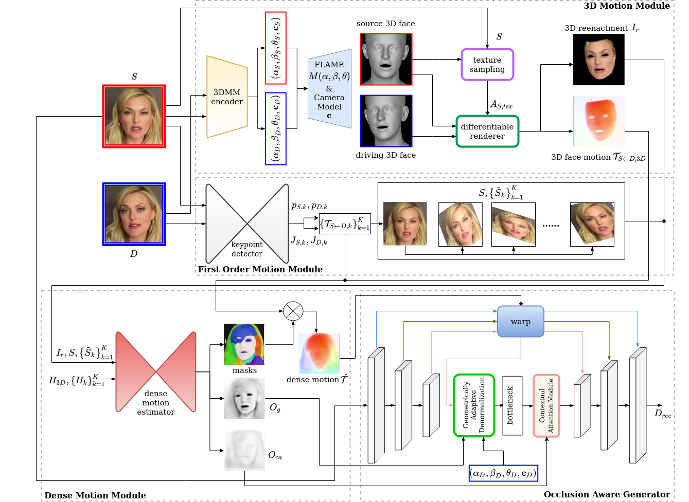

# SAFA: Structure Aware Face Animation (3DV2021)


Official Pytorch Implementation of 3DV2021 paper: [**SAFA: Structure Aware Face Animation**](https://arxiv.org/abs/2111.04928).


## Getting Started
```
git clone https://github.com/Qiulin-W/SAFA.git
```

## Installation
Python 3.6 or higher is recommended. 

### 1. Install PyTorch3D 
Follow the guidance from: https://github.com/facebookresearch/pytorch3d/blob/master/INSTALL.md.

### 2. Install other dependencies
To install other dependencies run:
```
pip install -r requirements.txt
```

## Usage

### 1. Preparation
a. Download [FLAME model](https://flame.is.tue.mpg.de/), choose FLAME 2020 and unzip it, put `generic_model.pkl` under `./modules/data`.

b. Download `head_template.obj`, `landmark_embedding.npy`, `uv_face_eye_mask.png` and `uv_face_mask.png` from [DECA/data](https://github.com/YadiraF/DECA/tree/master/data), and put them under `./module/data`.

c. Download SAFA model checkpoint from [Google Drive](https://drive.google.com/drive/folders/1sXzcAf9mIK08WISz9tjYBocaoTSA3ts_?usp=sharing) and put it under `./ckpt`.

d. (Optional) Download the pretrained face parser from [face-parsing.PyTorch](https://github.com/zllrunning/face-parsing.PyTorch) and put it under `./face_parsing/cp`.

### 2. Demos
We provide demos for animation and face swap.

a. Animation demo
```
python animation_demo --config config/end2end.yaml --checkpoint path/to/checkpoint --source_image_pth path/to/source_image --driving_video_pth path/to/driving_video --relative --adapt_scale --find_best_frame
```

b. Face swap demo
We adopt [face-parsing.PyTorch](https://github.com/zllrunning/face-parsing.PyTorch) for indicating the face regions in both the source and driving images.

For preprocessed source images and driving videos, run:
```
python face_swap_demo --config config/end2end.yaml --checkpoint path/to/checkpoint --source_image_pth path/to/source_image --driving_video_pth path/to/driving_video
```
For arbitrary images and videos, we use a face detector to detect and swap the corresponding face parts. Cropped images will be resized to 256*256 in order to fit to our model.
```
python face_swap_demo --config config/end2end.yaml --checkpoint path/to/checkpoint --source_image_pth path/to/source_image --driving_video_pth path/to/driving_video --use_detection
```

## Training
We modify the distributed traininig framework used in that of the [First Order Motion Model](https://github.com/AliaksandrSiarohin/first-order-model). Instead of using torch.nn.DataParallel (DP), we adopt torch.distributed.DistributedDataParallel (DDP) for faster training and more balanced GPU memory load. The training procedure is divided into two steps: (1) Pretrain the 3DMM estimator, (2) End-to-end Training.

### 3DMM estimator pre-training
```
CUDA_VISIBLE_DEVICES="0,1,2,3" python -m torch.distributed.launch --nproc_per_node 4 run_ddp.py --config config/pretrain.yaml
```

### End-to-end Training
```
CUDA_VISIBLE_DEVICES="0,1,2,3" python -m torch.distributed.launch --nproc_per_node 4 run_ddp.py --config config/end2end.yaml --tdmm_checkpoint path/to/tdmm_checkpoint_pth
```

## Inference

### Video reconstrucion
```
python run_ddp.py --config config/end2end.yaml --checkpoint path/to/checkpoint --mode reconstruction
``` 
### Image animation
```
python run_ddp.py --config config/end2end.yaml --checkpoint path/to/checkpoint --mode animation
``` 
### 3D face reconstruction
```
python tdmm_inference.py --data_dir directory/to/images --tdmm_checkpoint path/to/tdmm_checkpoint_pth
```

## Dataset and Preprocessing
We use [**VoxCeleb1**](https://www.robots.ox.ac.uk/~vgg/data/voxceleb/vox1.html) to train and evaluate our model. Original Youtube videos are downloaded, cropped and splited following the instructions from [video-preprocessing](https://github.com/AliaksandrSiarohin/video-preprocessing). 

To obtain the facial landmark meta data from the preprocessed videos, run:
```
python video_ldmk_meta.py --video_dir directory/to/preprocessed_videos out_dir directory/to/output_meta_files
```

## Citation
If you find our work useful to your research, please consider citing:
```
@article{wang2021safa,
  title={SAFA: Structure Aware Face Animation},
  author={Wang, Qiulin and Zhang, Lu and Li, Bo},
  journal={arXiv preprint arXiv:2111.04928},
  year={2021}
}
```

## License


## Acknowledgement
Codes are heavily borrowed from [First Order Motion Model](https://github.com/AliaksandrSiarohin/first-order-model). 
Some codes are also borrowed from [DECA](https://github.com/YadiraF/DECA), [generative-inpainting-pytorch](https://github.com/daa233/generative-inpainting-pytorch), [face-parsing.PyTorch](https://github.com/zllrunning/face-parsing.PyTorch), [video-preprocessing](https://github.com/AliaksandrSiarohin/video-preprocessing)
